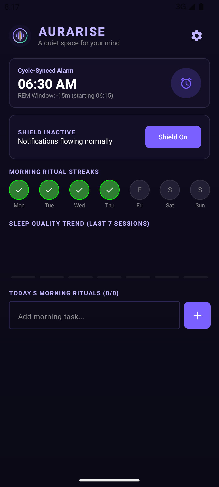
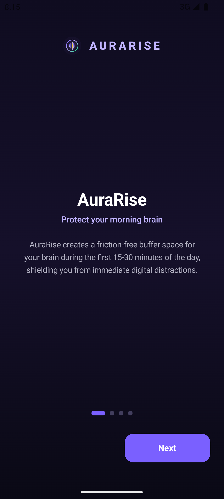
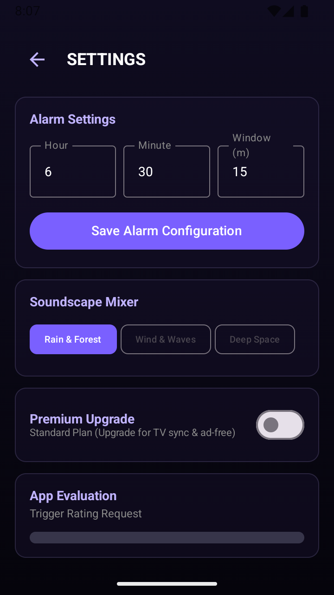
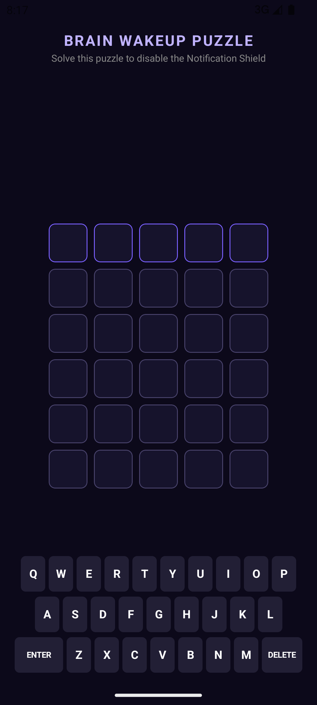

# MornShield: Your Morning Zen Space

MornShield is a privacy-first, multi-device ecosystem designed to protect your brain's "buffer zone" during the first 15–30 minutes of waking. It synchronizes across your Phone, Wear OS watch, and Android TV to ensure a calm, focused start to your day.

## 🌟 Key Features

### 🛡️ Notification Shield (Mobile)
Actively suppresses distracting app notifications (Slack, Gmail, Social Media) in volatile memory (RAM). No data is ever written to disk or sent to a cloud. You must solve a mindful "RISE" puzzle to drop the shield.

### ⌚ REM-Synced Alarms (Wear OS)
Uses on-device sensors to detect sleep stages and wake you up during your lightest REM cycle. Features a 60-second gradual binaural fade-in to prevent "alarm shock."

### 📺 Ambient Ritual Dashboard (Android TV)
Anchors your morning rituals on the least distracting screen in your home. Includes pixel-shifting burn-in prevention for OLED panels.

### 🎙️ AI Morning Brief
A naturally synthesized summary of your day: real-time local weather, calendar meetings, and your specific morning ritual checklist.

### 💎 Premium Features
*   **Ad-Free Experience**: Removes all AdMob integrations.
*   **Binaural Acoustic Engine**: Unlocks the 3rd layer of Alpha/Theta brain-wave frequencies.
*   **Unlimited TV Sync**: Full checklist synchronization beyond the first 3 tasks.
*   **Cross-Device Status**: Premium status syncs automatically across your local Wi-Fi.

## 🛠️ Tech Stack
- **Languages**: 100% Kotlin
- **UI**: Jetpack Compose (Mobile, Wear, TV)
- **Architecture**: Clean Multi-Module (:mobile, :wear, :tv, :core)
- **Local Data**: Room Database + Encrypted Backups
- **Sync**: Network Service Discovery (NSD) + TCP Sockets
- **Analytics/Config**: Firebase + Remote Config

## 📸 Screenshots

| Onboarding | Settings | Puzzle Unlock |
|:---:|:---:|:---:|
|  |  |  |

## 🔒 Privacy
MornShield operates with a **Zero-Cloud Policy**. Your notification data, sleep logs, and rituals never leave your local network.

---
Created with ❤️ for a more mindful world.
